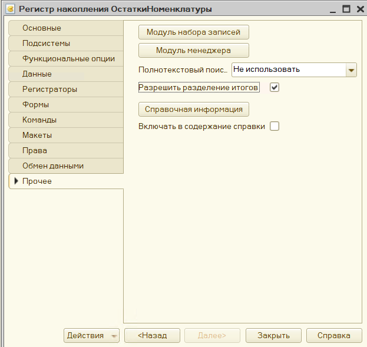

# Задачи оперативного учета

## Общие сведения
* записи в регистрах детализированы по дате и времени;
* записи расположены на оси по моменту времени: 
    * детализация до секунды;
    * детализация по регистратору внутри секунды;
    * момент времени недоступен для записи.
* нужно учитывать не только [условие задачи](./files/1C-Sp-Predp83-2022.pdf.pdf), но и [требования к экзамену](https://static.1c.ru/rus/partners/training/files/ATT83PL.rtf);
* по каждому регистру остатков нужно делать контроль;
* в каркасной конфигурации уже есть объекты, использовать их в первую очередь;
* в оборотном регистре нет вида движения, накапливается в одно сторону;
* не актуальные остатки считаются обратным пересчетом;
* не помесячные обороты считаются обратным пересчетом;
* обратный пересчет - это долго, поэтому есть:
    * промежуточные итоги для остатков;
    * агрегаты для не календарных месяцев;
    * большие объемы данных актуальны;
    * запись дольше, чтение быстрее, оптимально для отчетов;

## Проектирование регистра накопления
* ресурсы:
    * для количества точность - целое, если не указана в задаче;
    * длина по умолчанию;
    * на всякий случай ничего ставит не надо;
    * для суммы точность 2;
* кол-во и сумма - мера товара в разных единицах измерения; 
* колво - штуки, сумма - рубли;
* измерения: 
    * смотрим по отчёту как детализировано;
    * все отчёты кроме Ганта на экзамене на СКД;
    * у измерений обязательно запрет незаполненных значений.
* последовательность измерений - составные индексы;

* включение индексирования измерений - простые индексы;
* отбор в отчете - первое измерение, включение индексирования.
* регистраторы - документы движения товаров;
* разрешить разделение итогов всегда;

## Проектирование документов
* документы только из условия задачи (см. требования к экзамену);
* Приходная накладная: проверяем реквизиты, добавляем Склад;
* форму документа делатьне надо, если нет в условии;

- но вывод движений и обязательно их проверка, ошибка типов
- оперативное проведение: разные действия при проведении тек временем и задним числом
- делать на экз не надо, но знать надо
 - опер будущим запрещено
- тек временем влезть ранее уже проведеного
- на экз опер разрешить если явно не указано зарретить
- удаление движений: 3 режима
- авто при перепроведении 1 запись 2 удаление движ 3 проведение
- есть 2 подход корректировать движения, а не удалять, но это сложно
- новый подход к проведению - остальное потом из-за блокировок
- проблема блокировка работа с одними и теме же данными разными пользователями а одно аремя
- искажений не будет если разрешить только одному
- чем больше одновременно пользователей, тем больше вероятности искажения
- умеет субд + умеет платформа. Раньше не уиела
- ms sql проработан лучше, метод инф больше
- ms sql режим изоляции транзакций, блокирует лишнее, поэтому пришлось на кровле 1с делать 8.1
- данные в базе, данные в памяти
- транзакционнве, объектные блокировки
- подход: блокируем меньше данных и минимально по времени. Вероятности меньше, что пересечёмся
- но управлять можем только временем установки блокировки, снимается дл, всех регистров сама при завершении транзакуии
