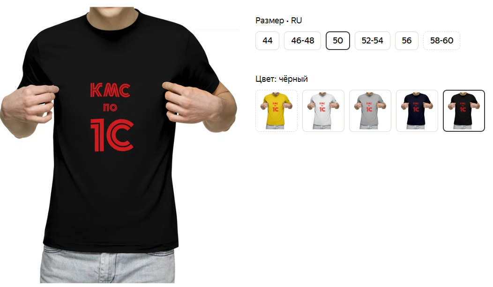

# Свойства и характеристики

## Свойства
- дополнительные параметры, которые характеризуют объект. Пример: цвет, размер товара.

## Характеристики
- коминации значений свойств. Пример: **Футболка КМС по 1С, черный, размер 50**

*удобно для интернет-магазина*

## Вариации условий
* Для сотрудников нужна возможность указывать различные свойства – пол, образование, наличие прав и т.п. 
* Организация занимается оптовой торговлей. Для описания товаров существуют различные характеристики, набор которых составляет свойство. Учет товаров ведется в разрезе свойств этих товаров, причем для каждого товара набор этих свойств может быть произвольный. Например, «ботинки черные 42 размера», «ботинки коричневые 42 размера» и «ботинки коричневые 44 размера утепленные» это один товар «ботинки», но с разными свойствами. «Черные 42 размера» будет являться свойством, а цвет «черный» и размер «42» являются характеристиками.
* Для каждой номенклатурной позиции (продукта, блюда) к ней добавляются любое количество характеристик. Набор характеристик является свойством. Например,Салат «огуречный, входит в комплексный обед, диетический» или томат «мелкий, красный, тепличный». «Огуречный», «входит в комплексный обед», «диетический» - это характеристики, а «Огуречный, входит в комплексный обед, диетический» - свойство.