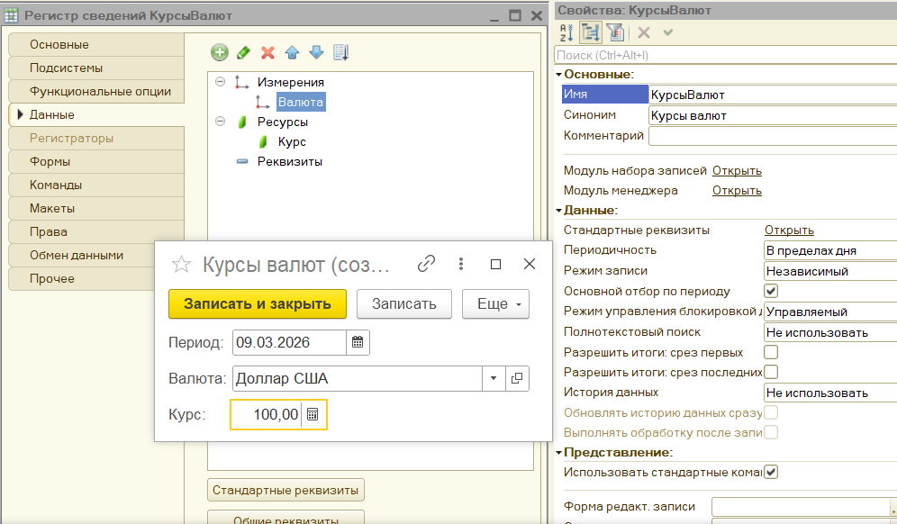

# Валютный учет

## Вариации условий
* Требуется организовать возможность ведения взаиморасчетов (счет «Покупатели») в разрезе контрагентов и договоров в валюте взаиморасчетов. С каждым контрагентом может быть заключено любое количество договоров (у каждого может быть своя валюта взаиморасчетов). Все взаиморасчеты по договору ведутся только в валюте, указанной в этом договоре, и рублевом эквиваленте. 
* Весь учет ведется в рублях и дополнительно в разных валютах в зависимости от проекта. Валюта указывается непосредственно в самом проекте. Для каждого проекта валюта может быть указана только одна.
* При проведении документа курс валюты должен быть взять на дату этого документа.
* Возникновение курсовых разниц при поставке и оплате не предполагается.
* Весь учет ведется одновременно в 2-х валютах: рубли и доллары. При проведении документов курс указывается непосредственно в самом документе. Возникновение курсовых разниц на себестоимость при продаже не предполагается.
* Начисление зарплаты сотрудникам предприятия осуществляется ежемесячно с использованием метода отклонений и ведется одновременно в двух валютах (долларах США и евро). В информационной базе нужно хранить историю изменений курса валют. При начислении зарплаты необходимо использовать курс валюты, актуальный на дату документа.
* Учет ведется в рублях, а с агентами дополнительно ведется в валюте, причем для каждого агента установлена своя собственная валюта, не подлежащая пересмотру. При начислении вознаграждения агенту, валютная сумма определяется исходя из рублевой суммы, валюты агента и курса, установленного для данной валюты на дату документа.
* Компания занимается оптовой торговлей. Отгрузка товаров покупателю отражается документом «Расходная накладная», причем каждая накладная может быть выставлена в своей валюте. Оплата от покупателя приходит в рублях и отражается документом «Приход денег». Одна оплата может относиться к нескольким накладным, в этом случае при проведении документа автоматически закрывается долг покупателя по отгрузке, начиная с самой ранней недоплаченной накладной и т.д. Курс валюты берется на дату оплаты.

## Курсы валют
